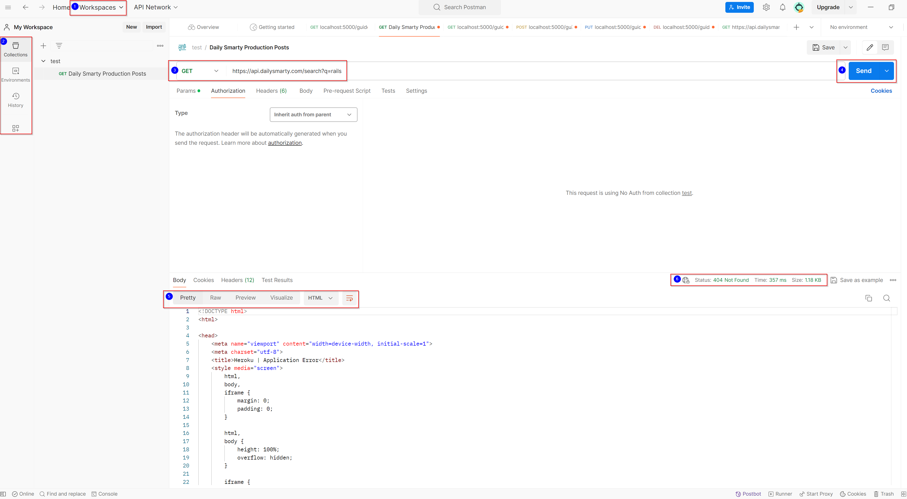

## Índice <a id="index"></a>

1. [¿Para qué usamos clases en Python?](#clases)
2. [¿Qué método se ejecuta automáticamente cuando se crea una instancia de una clase?](#__init__)
3. [¿Qué es un método dunder?](#dunder)
4. [¿Qué es un decorador de Python?](#decorador)
5. [¿Qué es el polimorfismo?](#polimorfismo)
6. [¿Qué es una API?](#api)
7. [¿Cuáles son los tres verbos de API?](#verbos)
8. [¿Qué es Postman?](#postman)
9. [¿Es MongoDB una base de datos SQL o NoSQL?](#mongodb)


### ¿Para qué usamos clases en Python? <a id="clases"></a>
Python es un lenguaje de programación orientado a objetos donde las clases funcionan como moldes o prototipos para crear los objetos. Las clases definen la estructura y el comportamiento de los objetos, y utilizarlas nos permite crear objetos que compartan atributos y características similares. Con las clases podemos escribir código más ordenado, flexible y fácil de mantener y leer.

#### Sintaxis
Para crear una clase, hay que usar la palabra clave **class** seguida del nombre en mayúscula y dos puntos.

A continuación, indentamos los atributos y las características de la clase.

Una vez que hayamos creado una clase, podremos crear objetos a partir de ella asignando a una variable el nombre de la clase seguido de paréntesis de apertura y cierre. Esto se denomina crear una instancia de una clase.

Para acceder a los atributos o métodos del objeto, debemos escribir el objeto seguido de un punto y el atributo o método que hayamos creado en la clase.

```python
class Nombre:
    atributos
    método()
objeto = Nombre()
print(objeto.atributo)
```

#### Ejemplo

```python
class Cat:
    pelt = 'Gold'
    sound = 'Meow'
    name = 'Whiskers'

# Creamos un objeto de la clase Cat
my_cat = Cat()

# Accedemos al atributo name
print(my_cat.name)  # Output: Whiskers
```

#### Fuentes
[Real Python](https://realpython.com/python-classes/) |
[W3Schools](https://www.w3schools.com/python/python_classes.asp) | [GeeksforGeeks](https://www.geeksforgeeks.org/python-classes-and-objects/?ref=lbp)

[Ir al índice](#index)

### ¿Qué método se ejecuta automáticamente cuando se crea una instancia de una clase? <a id="__init__"></a>
Python incorpora el método dunder `__init__()`, que siempre se ejecuta cuando se crea una instancia de una clase, permitiéndonos asignar valores a los atributos del objetos o llevar a cabo otras operaciones necesarias al crearlos.

#### Sintaxis
Para utilizar el método `__init__()`, escribimos **`def __init__():`** y, entre los paréntesis, incluimos argumentos con los que añadir valores a los atributos del objeto.

Las funciones incluidas en las clases, como `__init__()`, **necesitan un argumento por defecto**. La convención en Python es denominarlo **self**.

```python
class Nombre:
    def __init__(self, argumentos)
    atributos
```

#### Ejemplo
```python
class Cat:
    def __init__(self, pelt, sound, name):
        self.pelt = pelt
        self.sound = sound
        self.name = name

# Creamos dos objetos de la clase Cat
my_cat = Cat('Gold', 'Meow', 'Whiskers')
my_other_cat = Cat('Black', 'Grrr', 'Devil')

# Accedemos al atributo name de cada objeto creado
print(my_cat.name)  # Output: Whiskers
print(my_other_cat.name)  # Output: Devil
```
El método `__init__()` nos permite dar gran versatilidad a nuestro código, ya que gracias a él obtenemos un mayor nivel de abstracción con el que generar numerosos objetos con las mismas características sin tener que incluir sus atributos dentro de la clase. Es decir, pelt, sound y name son variables en la clase a las que se les asignan valores al crear cada objeto.

### ¿Qué es un método dunder? <a id="dunder"></a>
Los métodos dunder ("**d**ouble **under**score", doble guion bajo en español) en Python comienzan y terminan por __. Python los emplea automáticamente para realizar operaciones específicas.

#### Sintaxis
Los métodos dunder se escriben precedidos de dos guiones bajos y pospuestos de otros dos guiones bajos y paréntesis de apertura y cierre.

#### Ejemplo
```python
    __método_dunder__()
```
#### Principales métodos dunder
#### `__init__()` [Explicado arriba](#__init__)

#### `__str__()`

Este método controla qué se devuelve cuando el objeto de la clase se representa como una cadena. Su finalidad es que la cadena pueda ser leída por un humano.
#### Ejemplo
```python
class Cat:
    def __init__(self, pelt, sound, name):
        self.pelt = pelt
        self.sound = sound
        self.name = name

    def __str__(self):
        return f'My cat goes {self.sound}, its pelt is {self.pelt} and is called {self.name}.'
my_cat = Cat('gold', 'meow', 'Whiskers')
print(my_cat)  # Output: My cat goes meow, its pelt is gold and is called Whiskers.
```
#### `__repr__()`

Es similar al método `__str__()`, solo que la representación como una cadena está destinada a desarrolladores. Su finalidad es que la cadena pueda servir para recrear el objeto.

#### Ejemplo
```python
class Cat:
    def __init__(self, pelt, sound, name):
        self.pelt = pelt
        self.sound = sound
        self.name = name

    def __repr__(self):
        return f"{type(self).__name__}(pelt='{self.pelt}', sound='{self.sound}', name='{self.name}')"
my_cat = Cat('gold', 'meow', 'Whiskers')
print(my_cat)  # Output: Cat(pelt='gold', sound='meow', name='Whiskers')
```
Hay numerosos métodos dunder. Para más información, es posible consultar [esta sección de la documentación de Python](https://docs.python.org/3/reference/datamodel.html#basic-customization).
#### Fuentes
[Documentación de Python](https://docs.python.org/3/reference/datamodel.html) |
[Codecademy](https://www.codecademy.com/resources/docs/python/dunder-methods)

[Ir al índice](#index)

### ¿Qué es un decorador de Python? <a id="decorador"></a>
Los decoradores de Python son una herramienta que nos permite modificar el comportamiento de una función o clase. Con ellos podemos añadir funciones adicionales de forma dinámica y sin alterar el objeto original.

Para entender cómo funcionan los decoradores, es útil comprender primero ciertos aspectos de las funciones en Python. Las funciones son objetos de primera clase: pueden emplearse como argumentos, estar anidadas dentro de otras funciones o pasarse de un lado para otro de la misma manera que cualquier objeto (str, int, listas...).

#### Función como argumento
En el siguiente ejemplo se ilustra cómo una función (saluda) puede usarse como argumento dentro de otra (saluda_a_paco). En este caso, la función que se escribe sin paréntesis (saluda) es únicamente una referencia a una función. En la última línea de código, utilizamos la referencia a la función **hola**.

#### Ejemplo
```python
def hola(name):
  return f"Hola, {name}"
def saluda_a_paco(saluda):
  return saluda("Paco")

print(hola('Pepe')) # Output: Hola, Pepe
print(saluda_a_paco(hola)) # Output: Hola, Paco
```
#### Función anidada
El siguiente ejemplo ilustra cómo las funciones se pueden anidar dentro de otras. En este caso, function_1 tiene dos subfunciones, function_1_1 y function_1_2. Las funciones se ejecutan en orden de llamada (function_1_2 se ejecuta antes de function_1_1). Por otro lado, las subfunciones solo existen dentro de la función principal; no es posible llamarlas directamente de forma independiente.

#### Ejemplo
```python
def function_1():
  print("Función 1")

  def function_1_1():
      print("Función 1.1")

  def function_1_2():
      print("Función 1.2")

  function_1_2()
  function_1_1()
  return 'Función 1 ejecutada'
print(function_1()) # Output:
# Función 1
# Función 1.2
# Función 1.1
# Función 1 ejecutada
```
#### Función como valor de retorno
El siguiente ejemplo muestra cómo una función puede pasarse como valor de retorno de otra función. En este caso, las subfunciones function_1_1 y function_1_2 se devuelven como valor de function_1 dependiendo de la letra que se utilice como argumento.
#### Ejemplo
```python
def function_1(letra):
  def function_1_1():
    return "Función 1.1"

  def function_1_2():
    return "Función 1.2"

  if letra == 'a':
    return function_1_1
  else:
    return function_1_2
```
Los valores de retorno de function_1 son referencias a las subfunciones, ya que no tienen paréntesis, y se imprimen en la consola como estos objetos:
```python  
print(function_1('a')) # Output: <function function_1.<locals>.function_1_1 at 0x7a9fc0c87520>
print(function_1('b')) # Output: <function function_1.<locals>.function_1_2 at 0x7a9fc0c877f0>
```
Al asignar a variables function_1 con sus argumentos correspondientes, podemos acceder a los valores de retorno de las subfunciones.
```python  
function_1_1 = function_1('a')
function_1_2 = function_1('b')
print(function_1_1()) # Output: Función 1.1
print(function_1_2()) # Output: Función 1.2
```
#### Decoradores
Los decoradores no son otra cosa que funciones que envuelven o decoran otras funciones o clases.

En el siguiente ejemplo, la función sin_decorar imprime en la consola "Texto sin decorar".

A continuación tenemos la función decorador. Esta toma como argumento una función y tiene una función anidada en su interior. Dicha función anidada imprime en la consola 20 asteriscos, ejecuta la función que toma como argumento la función decorador, vuelve a imprimir otros 20 asteriscos y devuelve el resultado.

Al final del ejemplo se asigna a la variable función_decorada la función decorador con la función sin_decorar como argumento. Por último, se ejecuta la función_decorada.

#### Ejemplo
```python
def sin_decorar():
    print("Texto sin decorar")

def decorador(función):

    def anidada():
        print("*" * 20)
        función()
        print("*" * 20)
    return anidada

# Decora la función sin decorar
función_decorada = decorador(sin_decorar)

# Ejecuta la función decorada
función_decorada()

# Output:
***************
Función sin decorar
***************
```

#### Sintaxis
Python utiliza el símbolo @ para escribir explícitamente los decoradores, lo que simplifica mucho la sintaxis y lectura del código, ya que nos ahorra asignar la función decorador a una variable y llamarla.

Debemos escribir @ y el nombre del decorador inmediatamente encima de la función que vamos a decorar.
```python
@decorador
función a decorar
```
De este modo, el ejemplo de arriba quedaría así:

#### Ejemplo
```python
def decorador(función):

    def anidada():
        print("*" * 20)
        función()
        print("*" * 20)
    return anidada

@decorador
def sin_decorar():
    print("Función sin decorar")

sin_decorar()

# Output:
***************
Función sin decorar
***************
```

#### Combinar decoradores
Python nos permite combinar decoradores escribiéndolos uno encima del otro.

#### Ejemplo
```python
def decorador1(función):

  def anidada():
      print("+" * 20)
      función()
      print("+" * 20)
  return anidada

def decorador2(función):

    def anidada():
        print("*" * 20)
        función()
        print("*" * 20)
    return anidada

@decorador1
@decorador2
def sin_decorar():
    print("Función sin decorar")

sin_decorar()

# Output:
++++++++++++++++++++
********************
Función sin decorar
********************
++++++++++++++++++++
```

#### Fuentes
[GeeksforGeeks](https://www.geeksforgeeks.org/decorators-in-python/?ref=header_search) |
[Codecademy](https://www.codecademy.com/resources/docs/python/decorators) |
[Real Python](https://realpython.com/primer-on-python-decorators/) |
[W3Schools](https://www.w3schools.com/python/python_classes.asp) |
[Programiz](https://www.programiz.com/python-programming/decorator)

[Ir al índice](#index)

### ¿Qué es el polimorfismo? <a id="polimorfismo"></a>
El polimorfismo en programación nos permite que métodos, objetos u operadores con el mismo nombre se ejecuten en muchos objetos y clases.


#### Polimorfismo en operadores
En el siguiente ejemplo básico se muestra el polimorfismo del operador +, que suma dos números en el primer caso y concatena dos cadenas en el segundo.

#### Ejemplo
```python
numero1 = 3
numero2 = 2
print(numero1+numero2)
# Output = 5

cadena1 = "Hola "
cadena2 = "mundo"
print(cadena1+cadena2)
# Output = "Hola mundo"
```
#### Polimorfismo en funciones
El siguiente ejemplo muestra el polimorfismo de la función len() con distintos tipos de datos: una cadena (calcula el número de caracteres), una lista (calcula el número de elementos) y un diccionario (calcula el número de claves)
#### Ejemplo
```python
print(len("Programación"))
print(len(["Python", "HTML", "CSS"]))
print(len({"Equipo": "Real Sociedad", "Estadio": "Anoeta"}))
# Output = 
12
3
2
```
#### Polimorfismo en clases
El polimorfismo nos permite que diferentes clases tengan métodos con el mismo nombre.
En el siguiente ejemplo hemos creado dos clases, Computer y Car. Ambas son parecidas y comparten el mismo método info.

Sin necesidad de crear una clase común podemos crear una tupla con ellas e iterar con la variable product.

#### Ejemplo
```python
class Computer:
  def __init__(self, name, price):
      self.name = name
      self.price = price

  def info(self):
      print(f"{self.name} costs {self.price} €.")

  
class Car:
  def __init__(self, name, price):
      self.name = name
      self.price = price

  def info(self):
    print(f"{self.name} costs {self.price} €.")

computer1 = Computer("Lenovo", 1525)
car1 = Car("Toyota Prius", 30000)

for product in (computer1, car1):
  product.info()

# Output =
Lenovo costs 1525 €.
Toyota Prius costs 30000 €.
```

#### Herencia y polimorfismo

Las clases en Python pueden heredan los métodos de la clase principal gracias al polimorfismo, aunque podemos anular algunos métodos heredables en nuestro código (method overriding).

En el siguiente ejemplo, hemos creado la clase Product de la que las clases Computer y Car heredan los métodos `__init__` e info. La relación entre la clase principal, Product, y las otras clases la establecemos añadiendo el nombre de la clase Product entre paréntesis al definir Computer y Car.

La clase Computer heredará también el método in_stock de la clase Product, mientras que la clase Car no heredará el método in_stock de Product, ya que lo hemos anulado para imprimir en su lugar "Out of stock"
#### Ejemplo
```python
class Product:
  def __init__(self, name, price):
    self.name = name
    self.price = price

  def info(self):
    print(f"{self.name} costs {self.price} €.")

  def in_stock(self):
    print("In stock")

class Computer(Product):
  pass

class Car(Product):
  def in_stock(self):
    print('Out of stock')

computer1 = Computer("Lenovo", 1525)
car1 = Car("Toyota Prius", 30000)

for product in (computer1, car1):
  product.info()
  product.in_stock()

# Output =
Lenovo costs 1525 €.
In stock
Toyota Prius costs 30000 €.
Out of stock
```

#### Fuentes
[W3 Schools](https://www.w3schools.com/python/python_polymorphism.asp)
[Programiz](https://www.programiz.com/python-programming/polymorphism)
[El libro de Python](https://ellibrodepython.com/herencia-en-python)

[Ir al índice](#index)

### ¿Qué es una API? <a id="api"></a>
Una API ("Application Programming Interface") es un conjunto de protocolos, herramientas y definiciones que permite a diferentes aplicaciones de software comunicarse entre sí.

#### Funcionamiento
Las APIs funcionan compartiendo datos entre aplicaciones, sistemas y dispositivos mediante un ciclo de solicitud y respuesta.

El cliente de la API inicia el ciclo enviando una solicidud a la API (por ejemplo, cuando un usuario pulsa un botón). El servidor de la API recibe y gestiona la solicitud, enviando una respuesta al cliente.

La solicitud tendrá normalmente los siguientes componentes:

1. Un punto final (endpoint), que es una URL dedicada para acceder a un recurso específico.

2. Un método, que indica qué operación quiere hacer el cliente. Las [APIs REST](https://blog.postman.com/rest-api-examples/?_gl=1*1baauzn*_ga*ODE1ODI1NjA4LjE3MTA0NDIyMjc.*_ga_CX7P9K6W67*MTcxMTM0NzY5Ny4yLjEuMTcxMTM0OTg3OS42MC4wLjA.) son compatibles con los métodos HTTP, que emplean [distintos verbos](#verbos) para realizar acciones básicas como obtener, crear, actualizar y borrar datos.

3. Unos parámetros, que proporcionan instrucciones específicas para el proceso. Pueden incluirse en la URL, en los encabezados o en el cuerpo de la solicitud.

4. Unos encabezados, que son parejas de claves y valores con más detalles sobre la solicitud (por ejemplo, credenciales de autenticación).

5. Un cuerpo, que es la parte principal de la solicitud e incluye los datos necesarios para ella.

Tras autenticar, validar y obtener los datos, el servidor de la API envía una respuesta al cliente. Esta contendrá habitualmente los siguientes campos:

1. Un código de estado de tres dígitos, que indica el resultado de la solicitud (por ejemplo, "200 OK" si se el servidor ha devuelto correctamente los datos solicitados). [Más información sobre los códigos de estado](https://developer.mozilla.org/en-US/docs/Web/HTTP/Status)

2. Unos encabezados de respuesta, similares a los de solicitud y que proporcionan información adicional sobre la respuesta del servidor.

3. Un cuerpo de respuesta, con los datos o contenido que ha solicitado el cliente o un mensaje de error si procede.

#### Ventajas
Las APIs permiten automatizar el trabajo repetitivo, contribuyen a innovar, proporcionan una capa adicional de seguridad y ayudan a reducir costes en el desarrollo.

#### Fuentes
[Postman](https://www.postman.com/what-is-an-api/) |
[AppMaster](https://appmaster.io/es/blog/apis-para-principiantes-como-utilizar-una-api-una-guia-completa) |
[mdn web docs](https://developer.mozilla.org/en-US/docs/Web/HTTP/Status)

[Ir al índice](#index)

### ¿Cuáles son los tres verbos de API? <a id="verbos"></a>
Hay 9 [verbos HTTP](https://developer.mozilla.org/en-US/docs/Web/HTTP/Methods), de los que las API utilizan habitualmente estos cuatro:
#### GET

Se utiliza para obtener datos de un servidor. Con él se puede acceder a todos los recursos de un mismo tipo o a un recurso específico. Las solicitudes de API que emplean el verbo GET no suelen incluir un cuerpo en la solicitud.

#### POST

Se emplea para crear nuevos recursos en el servidor y normalmente va acompañado de datos en el cuerpo de la solicitud.

#### PUT

Se utiliza para actualizar un recurso en el servidor, **reemplazándolo en su totalidad**.
Cualquier propiedad del recurso que estuviera en el servidor y no se halle en el cuerpo de la solicitud se eliminará.

#### PATCH

También se utiliza para actualizar un recurso en el servidor, aunque permite actualizar propiedades específicas **sin sobrescribir** otras.

#### DELETE

Se emplea para eliminar permanentemente recursos del servidor.

#### Fuentes
[Dev.to](https://dev.to/atanda0x/rest-api-best-practice-understanding-verbs-and-status-code-fei#rest-api-verbs) |
[mdn web docs](https://developer.mozilla.org/en-US/docs/Web/HTTP/Methods)|
[Postman](https://www.postman.com/what-is-an-api/)

[Ir al índice](#index)

### ¿Qué es Postman? <a id="postman"></a>
Postman es una plataforma colaborativa de desarrollo de APIs. Se fundamenta en un repositorio central de APIs, y cuenta con sus propias herramientas para desarrollar, diseñar, documentar y testear APIs.

Dispone de una aplicación de escritorio y una aplicación para el navegador: ambas presentan una interfaz sencilla con la que se pueden crear solicitudes de API y que es compatible con los [verbos HTTP](https://developer.mozilla.org/en-US/docs/Web/HTTP/Methods).

#### Aplicación de escritorio

Las características básicas de la aplicación de escritorio son las siguientes:

1. Nos permite organizar nuestro trabajo en espacios de trabajo (Workspaces), que pueden tener diferentes grados de privacidad.
2. Dentro de los espacios de trabajo podemos crear colecciones (Collections) donde almacenar nuestras solicitudes de API agrupadas, por ejemplo. También podemos acceder al historial (History) de nuestro trabajo.
3. Nos permite introducir fácilmente distintos verbos de API para cada tipo de solicitud mediante un menú desplegable, y añadir la dirección de la API con la que queremos contactar.
4. El botón enviar (Send) nos permite enviar la solicitud o enviarla y descargarla.
5. Una vez enviada, la respuesta de la API aparece en la parte inferior de la pantalla, donde podemos, entre otras cosas, cambiar el formato de visualización (de HTML a JSON, por ejemplo)
6. El estado de la solicitud se indica en la sección Status y se corresponde con los [códigos de estado HTML](https://developer.mozilla.org/en-US/docs/Web/HTTP/Status).



#### Fuentes
[Postman academy](https://academy.postman.com/what-is-postman)

[Ir al índice](#index)

### ¿Es MongoDB una base de datos SQL o NoSQL? <a id="mongodb"></a>
MongoDB es un sistema de gestión de bases de datos no relacionales (NoSQL) de código abierto.
### Bases de datos relacionales (SQL)
SQL (“Structured Query Language”) es el lenguaje de programación usado en la gestión de bases de datos relacionales desde los años 70. Las bases de datos SQL cuentan con un **esquema predefinido y rígido** organizado en filas y columnas relacionadas entre sí.

### Bases de datos no relacionales (NoSQL)
Las bases de datos no relacionales almacenan los datos de una manera distinta a las relaciones tabulares empleadas en SQL. Emplean **estructuras más flexibles** para acomodar los datos.
#### Conceptos básicos de MongoDB
MongoDB almacena la información en tres capas:

1 - **Bases de datos**

Al igual que otros sistemas de gestión de bases de datos, MongoDB organiza los datos en bases de datos. Para crear o usar una base de datos, utilizamos en el terminal **use** seguido del nombre de la base de datos.
```console
>use mongoCourse
switched to db mongoCourse
mongoCourse> 
```
2 - **Colecciones**

Dentro de cada base de datos, los datos se organizan en colecciones, que son similares a las tablas de las bases de datos relacionales. No obstante, MongoDB no obliga a utilizar un esquema, por lo que cada documento en una coleción puede tener una estructura diferente. Podemos ver las colecciones de una base de datos escribiendo **show collections** en la terminal.
```console
mongoCourse> show collections
books
mongoCourse>
```
3 - **Documentos**

El nivel más básico de MongoDB son los documentos, que se asemejan a JSON y contienen un conjunto de claves y valores donde las claves son cadenas y los valores pueden ser distintos tipos de datos. Ejemplo de documento:

```console
  {
    _id: ObjectId('65f9cb430fa7d995c18bf204'),
    name: 'Deep Work: Rules for Focused Success in a Distracted World',
    startDate: ISODate('2024-03-19T17:28:35.626Z'),
    authors: [ { name: 'Cal Newport' } ]
  }
```


#### Fuentes
[IBM](https://www.ibm.com/es-es/topics/mongodb)
 |
[Integrate](https://www.integrate.io/blog/the-sql-vs-nosql-difference/)
 |
[Coursera](https://www.coursera.org/articles/nosql-vs-sql)

[Ir al índice](#index)