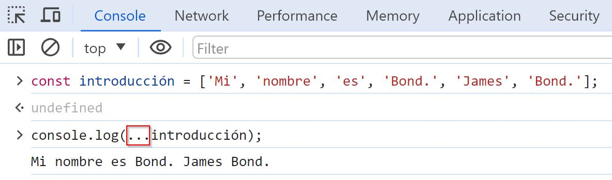
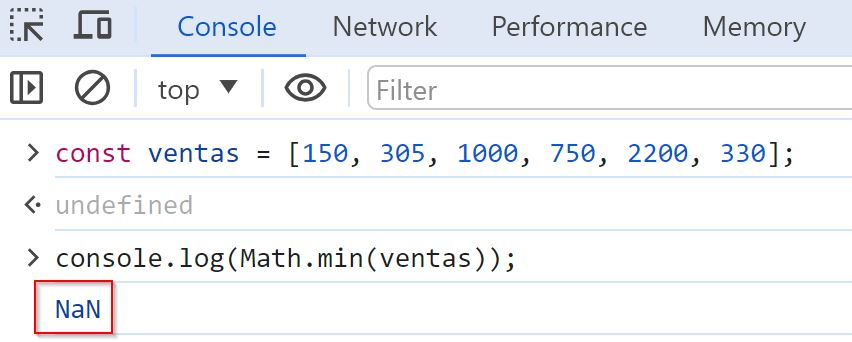

# 📈 ¿Qué hace el operador de extensión en JavaScript?

El operador de extensión se puede utilizar con un objeto iterable o una matriz para expandirlos, aunque también nos sirve para combinarlos, copiarlos, trabajar con argumentos de función y realizar la desestructuración de objetos de manera eficiente.

Para emplear el operador de extensión solo tenemos que escribir tres puntos (`...`) delante de la palabra sobre la que queramos que actúe.

#### Sintaxis

```
...palabra
```

### Expandir una matriz

Podemos emplearlo sobre una matriz para expandirla.

<figure><figcaption><p>Ejemplo del operador de expansión en acción.</p></figcaption></figure>

### Copiar una matriz

Al copiar una matriz mediante una asignación normal, la original y la copia hacen referencia al mismo objeto, por lo que ambas se modificarán si una de ellas es modificada:

```javascript
const matriz1 = [ 2, 4, 6];
const matriz2 = matriz1;

console.log(matriz1); // [2,4,6]
console.log(matriz2); // [2,4,6]

// Al añadir un valor a la matriz2...
matriz2.push(8);

// ... se añade también a la matriz1
console.log(matriz1); // [2,4,6,8]
console.log(matriz2); // [2,4,6,8]
```

Para copiar lograr que ambas matrices no hagan referencia a la misma, debemos emplear el operador de extensión.

```javascript
const matriz1 = [ 2, 4, 6];
// Copiamos con el operador de extensión
const matriz2 = [...matriz1];

console.log(matriz1); // [2,4,6]
console.log(matriz2); // [2,4,6]

// Al añadir un valor a la matriz2...
matriz2.push(8);

// ... ya no se añade también a la matriz1
console.log(matriz1); // [2,4,6]
console.log(matriz2); // [2,4,6,8]
```


### Combinar matrices

También podemos utilizarlo para combinar una matriz con otra.

```javascript
const ahorros2023 = [150, 200, 175, 300];
const ahorros2024 = [...ahorros2023, 100, 75, 350];

console.log(ahorros2024); // [150,200,175,300,100,75,350]
```


### Combinar objetos

No solo las matrices pueden combinarse, sino también los objetos:

```javascript
const objeto1 = {
  nombre: 'Jesús',
  apellido: 'Díaz'
}
const objeto2 = {
  idioma: 'español',
  edad: 43,
}

const objeto3 = {...objeto1, ...objeto2};

console.log(objeto3)
// {nombre: 'Jesús', apellido: 'Díaz', idioma: 'español', edad: 43}
```


### Trabajar con argumentos de función

```javascript
const ventas = [150, 305, 1000, 750, 2200, 330];
console.log(Math.min(...ventas)); // 150
```

En el ejemplo de arriba, la función `Math.min()` admite argumentos numéricos, pero no una matriz. Usar directamente una matriz devuelve `NaN` (Not a Number), como se ve en este ejemplo:

<figure><figcaption><p>Se obtiene NaN al pasar directamente la matriz como argumento</p></figcaption></figure>


### Deconstruir objetos

Como hemos mostrado en la sección anterior, el operador de extensión se puede utilizar para [deconstruir matrices](4-que-es-la-deconstruccion-de-variables.md) u objetos. El siguiente ejemplo ilustra cómo deconstruir un objeto conservando únicamente las dos variables iniciales

```javascript
const usuario = {
  nombre: 'Ramón',
  apellido: 'Zamora',
  edad: 35,
  provincia: 'Teruel',
  estado_civil: 'casado'
}

let {nombre, apellido, ...otros_datos} = usuario;

console.log(nombre); // "Ramón"
console.log(apellido); // "Zamora"
console.log(otros_datos);
/*
{
  "edad": 35,
  "provincia": "Teruel",
  "estado_civil": "casado"
}
*/
```


### Parámetro Rest

Cuando el operador de expansión se utiliza como parámetro en una función se denomina **parámetro Rest**. Gracias a él es posible lograr que una función admita cualquier número de argumentos. Al usarlo, estos se pasan a la función como una matriz.

```javascript
let miFunción = function (...argumentos) {
    console.log(argumentos);
}

miFunción(8); // [8]
miFunción(7,1,4); // [7,1,4]
```

También es posible pasar múltiples argumentos a una función empleando el operador de expansión al hacer una llamada a la función. En este caso, la función toma los argumentos que necesita y descarta el resto.

```javascript
let miFunción = function (arg1, arg2, arg3, arg4) {
    console.log(arg1, arg2, arg3, arg4);
}

miLista = [8, 7, 19, 32, 0, 78, 49] // lista de 7 cifras
miFunción(...miLista) // 8 7 19 32 (solo se incluyen 4 cifras)
```


### Vídeo de resumen



### Fuentes

[mdn](https://developer.mozilla.org/en-US/docs/Web/JavaScript/Reference/Operators/Spread\_syntax) | [W3Schools](https://www.w3schools.com/jsref/jsref\_operators.asp) | [Programiz](https://www.programiz.com/javascript/spread-operator) | [javascript.info](https://javascript.info/iterable)
