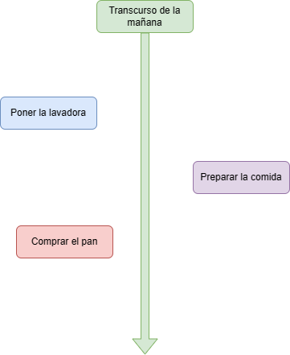

# 🤞 ¿Qué es una promesa en JS?

### Una promesa es un objeto

Una promesa es un objeto que gestiona operaciones asíncronas (aquellas que pueden ejecutarse independientemente del flujo principal del programa). En concreto, una promesa representa la culminación o fallo de una operación asíncrona y el valor resultante.

Imaginemos que tenemos tres tareas domésticas pendientes a lo largo de la mañana:

1. Poner la lavadora
2. Preparar la comida
3. Comprar el pan

Podríamos considerar cada una como una operación asíncrona. Estas se desarrollarían independientemente del flujo principal del programa (la mañana) y podrían culminarse con éxito o producir un fallo.

<figure><figcaption></figcaption></figure>

### Características

Una promesa puede los siguientes tres estados:

1. Pendiente: Es el estado inicial e implica que el proceso no se ha completado.
2. Completada: Representa que la promesa se ha llevado a cabo satisfactoriamente.&#x20;
3. Rechazada: Representa que ha habido algún error y la promesa no se ha podido completar.

Por ejemplo, antes de ir a por el pan, la tarea estará pendiente; cuando lo traigamos, estará completada y, si vamos tarde y no queda pan en la panadería, la tarea estaría rechazada.

A su vez, una promesa tiene unos resultados:

1. undefined: Cuando la promesa está pendiente.
2. Un valor: Cuando la promesa se ha completado.
3. Un objeto error: Cuando la promesa ha sido rechazada.


<figure><figcaption></figcaption></figure>

### Para qué se utiliza

Las promesas son una parte esencial de la programación moderna en JavaScript, especialmente en el desarrollo de aplicaciones web que interactúan con servicios externos.

Las promesas se utilizan para gestionar operaciones asíncronas en JavaScript, como las llamadas a APIs externas. Por ejemplo, al llamar a la API de Twitter para obtener publicaciones, es posible que deseemos gestionar tanto la respuesta correcta como la de error de manera adecuada.

En la analogía de tareas domésticas, cada una llevará un tiempo diferente y puede resultar en distintos estados, por lo que las utilizaremos como promesas a continuación para comprender el funcionamiento.

### Por qué se utiliza

Antes de la introducción de las promesas en JavaScript en 2015, la forma más común de gestionar operaciones asíncronas era con devoluciones de llamada (callbacks). Estas son funciones que se pasan como argumentos a otras funciones y se ejecutaban cuando una operación asíncrona había sido completada.

No obstante, la gestión de operaciones asíncronas implica gestionar el resultado de una operación antes de comenzar otra y, cuando se anidan muchas devoluciones de llamada, se produce lo que se denomina "callback hell": un código con muchos niveles de indentación que resulta difícil de comprender y mantener.

#### Ejemplo de callback

```javascript
api(function(resultado){
    api2(function(resultado2){
        api3(function(resultado3){
             acción
            if(error) {
                gestión de error
            }
            else {
                acción
            }
        });
    });
});
```

Afortunadamente, las promesas tienen una sintaxis fácil de comprender y mantener.

#### Ejemplo de promesa

```javascript
promesa().then(function(resultado) {return promesa2();})
         .then(function(resultado2) {return promesa3();})
         .then(function(resultado3) {acción})
         .catch(function(error) {gestión de errores});
```

### Sintaxis

Para crear una promesa, se utilizan las palabras clave `new Promise`. Dentro del constructor de promesa debemos añadir una función como argumento y, por convención, `resolve` y `reject` para ambos escenarios de respuesta. Si la promesa se completa, se ejecuta la función `resolve`. En caso contrario, se ejecuta `reject`.

```javascript
variable = new Promise(function(resolve, reject) {
  acción
  });
```

**Ejemplo**

En el siguiente ejemplo creamos una variable `lavadoraPuesta` y le hemos asignado el valor `true`. A continuación hemos creado una función llamada `ponerLavadora` que devuelve una promesa dentro de la que hemos incluido un condicional. Este comprueba el valor de la variable `lavadoraPuesta`. Si es verdadero, ejecuta la función `resolve`, que imprime `¡Ropa lavada!`. Si es falso, ejecuta la función `reject` e imprime `'No has lavado la ropa...'`.

```javascript
const lavadoraPuesta = true;

function ponerLavadora () {
  return new Promise(function(resolve, reject) {
  if (lavadoraPuesta === true) {
    resolve(console.log('¡Ropa lavada!'));
  } else {
    reject(console.log('No has lavado la ropa...'));
  }
})
};

// ¡Ropa lavada!
```

<figure><figcaption></figcaption></figure>

### Métodos de las promesas

**Métodos then() y catch()**

Empleamos este método con una devolución de llamada a la función si promesa se ha completado. El argumento de este método es una función que se ejecuta cuando la promesa se resuelve correctamente y recibe el resultado.

Catch tiene un funcionamiento análogo, aunque se emplea para gestionar que la promesa se ha rechazado.

**Sintaxis**

```javascript
promesa.then(
  function(resultado)
);
```

```javascript
promesa.catch(
  function(error)
);
```

**Ejemplo**

En el siguiente ejemplo hemos pasado los console.log del condicional de la promesa a los métodos `then` y `catch` respectivamente.

```javascript
const lavadoraPuesta = true;

function ponerLavadora () {
  return new Promise(function(resolve, reject) {
  if (lavadoraPuesta === true) {
    resolve('¡Ropa lavada!');
  } else {
    reject('No has lavado la ropa...');
  }
})
};
ponerLavadora().then(function(resultado) {
  console.log(resultado);
});

ponerLavadora().catch(function(error) {
  console.log(error);
});
// ¡Ropa lavada!
```

**Método finally()**

Este método tiene una sintaxis idéntica a then y se ejecuta siempre, independientemente de si la promesa se ha completado o ha sido rechazada. La idea de este método es realizar tareas de limpieza o finalización cuando las operaciones anteriores han terminado.

**Ejemplo**

En el siguiente ejemplo añadimos un método `finally` para contar los intentos de realizar las tareas, independientemente de si la promesa se completa o se rechaza.

```javascript
let intentosdeTarea = 0;
const lavadoraPuesta = true;

function ponerLavadora () {
  return new Promise(function(resolve, reject) {
  if (lavadoraPuesta === true) {
    resolve('¡Ropa lavada!');
  } else {
    reject('No has lavado la ropa...');
  }
})
};
ponerLavadora().then(function(resultado) {
  console.log(resultado);
});

ponerLavadora().catch(function(error) {
  console.log(error);
});

ponerLavadora().finally(function() {
  intentosdeTarea++;
  console.log(`Intentos: ${intentosdeTarea}`);
});
// ¡Ropa lavada!
// Intentos: 1
```

**Otros métodos**

En [esta página](https://developer.mozilla.org/en-US/docs/Web/JavaScript/Reference/Global\_Objects/Promise/all) se pueden consultar los otros métodos disponibles para las promesas.

### Encadenar promesas

Las promesas cobran verdadera utilidad cuando es necesario gestionar más de una operación asíncrona. En este escenario, las promesas se encadenan una detrás de otra y se realizan distintas operaciones cuando una promesa se ha resuelto con los métodos `then()`, `catch()` y `finally()`.

Vamos a crear dos funciones que devuelvan promesas para nuestras otras tareas domésticas: preparar la comida y comprar el pan.

```javascript
const comidaPreparada = true;

function prepararComida () {
  return new Promise(function(resolve, reject) {
  if (comidaPreparada === true) {
    resolve(console.log('¡Comida hecha!'));
  } else {
    reject(console.log('No has preparado la comida...'));
  }
})
};
prepararComida();
// ¡Comida hecha!
```

```javascript
const panComprado = true;

function comprarPan () {
  return new Promise(function(resolve, reject) {
  if (panComprado === true) {
    resolve(console.log('¡Pan comprado!'));
  } else {
    reject(console.log('No has comprado el pan...'));
  }
})
};
comprarPan();
// ¡Pan comprado!
```

Por último, vamos a anidar las tres promesas con el método `then()`:

```javascript
ponerLavadora().then(resultado => {console.log(resultado); return comprarPan()})
               .then(resultado => {console.log(resultado); return prepararComida()})
               .then(resultado => {console.log(resultado); console.log('¡Has completado todas las tareas!')})
               .catch(error => {console.error(error)})
```

El código de las tres tareas y las promesas anidadas está [en este archivo](sample\_code\_files/promesas\_tareas\_dom%C3%A9sticas.js).

### Vídeo de resumen



### Fuentes

[mdn](https://developer.mozilla.org/en-US/docs/Web/JavaScript/Reference/Global\_Objects/Promise) | [W3Schools](https://www.w3schools.com/js/js\_promise.asp) | [Programiz](https://www.programiz.com/javascript/promise) | [Javascript.info](https://javascript.info/promise-basics)
